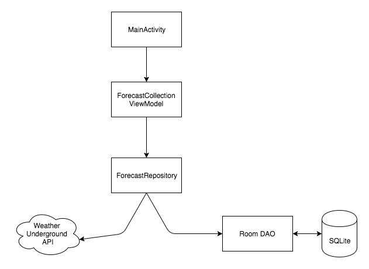

## Weather.io

Fancy a quick 10-day weather forecast for any city you like? **Weather.io** is the app for you. It is a simple single page Android
application which provides informative weather forecast.

It is build using Java, Kotlin, and Android architecture components.

### Weather.io Architecture

The app follows a MVVM architecture pattern. The android activity functions as the view, the viewmodel holds the business logic
and properties in the form of live data which the activity observes.

The viewmodel works with the repository which abstracts out the data sources, in this case the weather underground API and the forecast 
database.

The Viewmodel extends the architecture components ViewModel class, the viewmodel holds LiveData objects that the activity observes.
The caching was achieved using a SQLite database which makes use of the **Room persistence library**.
Caching comes in handy to provide quick data to the view and also provide weather data(albiet stale) when the user is offline.

**Dependency injection** was achieved using the Dagger 2 library.

### Testing efforts
* The viewmodel and the repository have been unit tested for positive and erroneous situations.
* Automation testing was used to test the view(activity).

### Other tools used on the project
* Kotlin (the view and a couple of model classes were written in Kotlin)
* Android architecture components (ViewModel, LiveData and Room)
* RxJava and RxAndroid ( Reactive programming and multi threading)
* Retrofit
* Dagger 2 (Dependency Injection)
* Picasso (Image loading, rendering and caching)
* Timber (Logging)
* Mockito (Unit testing)
* Espresso (Automation/UI testing)
* Stetho (for debugging purposes only...)

**P.S**: The app uses responsive design to work with different phone and tablet sizes, inflating different layouts to achieve this. Please find screenshots in the screenshots folder.
